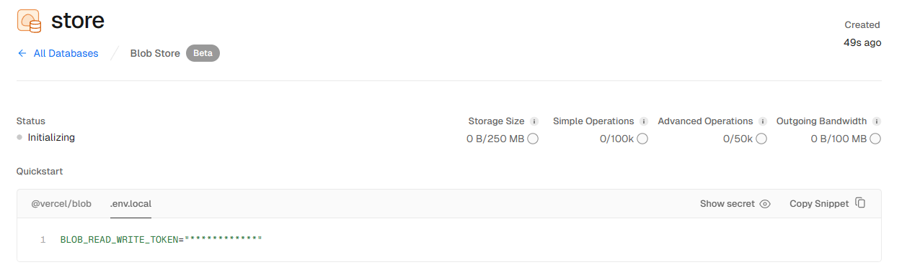
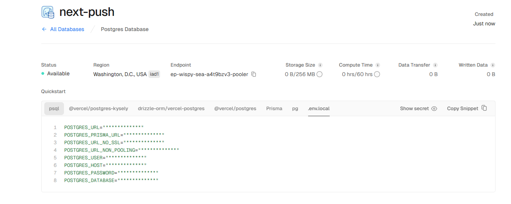
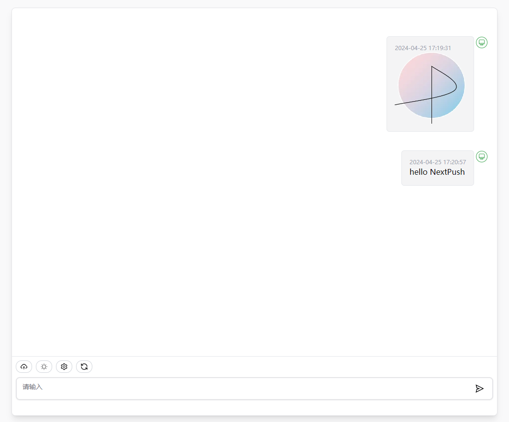

<h1 align="center">NEXT-PUSH</h1>

免费部署你的私人多端互传消息应用。

## 主要功能

- 在 1 分钟内使用 Vercel **免费一键部署**
- 精心设计的 UI，响应式设计，支持深色模式
- 支持图片,文件上传
- 支持PWA
- 消息api推送  GET {{url}}/api/message?text=123 | POST {{url}}/api/message, body:{text:123}

## 使用

1. 注册[vercel](https://vercel.com)账号;
2. 转到[Storage – Dashboard](https://vercel.com/puri-seths-projects/~/stores)
3. 创建Blob,获取`BLOB_READ_WRITE_TOKEN` 
4. 创建Postgres,获取`POSTGRES_URL`
5. 点击右侧按钮开始部署：
  ，直接使用 Github 账号登陆即可，记得在环境变量页填入 `BLOB_READ_WRITE_TOKEN`,`POSTGRES_URL`；
6. 部署完毕后，即可开始使用；
7. （可选）[绑定自定义域名](https://vercel.com/docs/concepts/projects/domains/add-a-domain)：Vercel 分配的域名 DNS 在某些区域被污染了，绑定自定义域名即可直连。

## 参与贡献
[本地运行](./DEVELOPMENT.md)

## 依赖
- [NextJS](https://nextjs.org/)
- [trpc](https://trpc.io/)
- [prisma](https://www.prisma.io/)
- [zustand](https://github.com/pmndrs/zustand)

## 截图

## 开源协议

[MIT](https://opensource.org/license/mit/)
