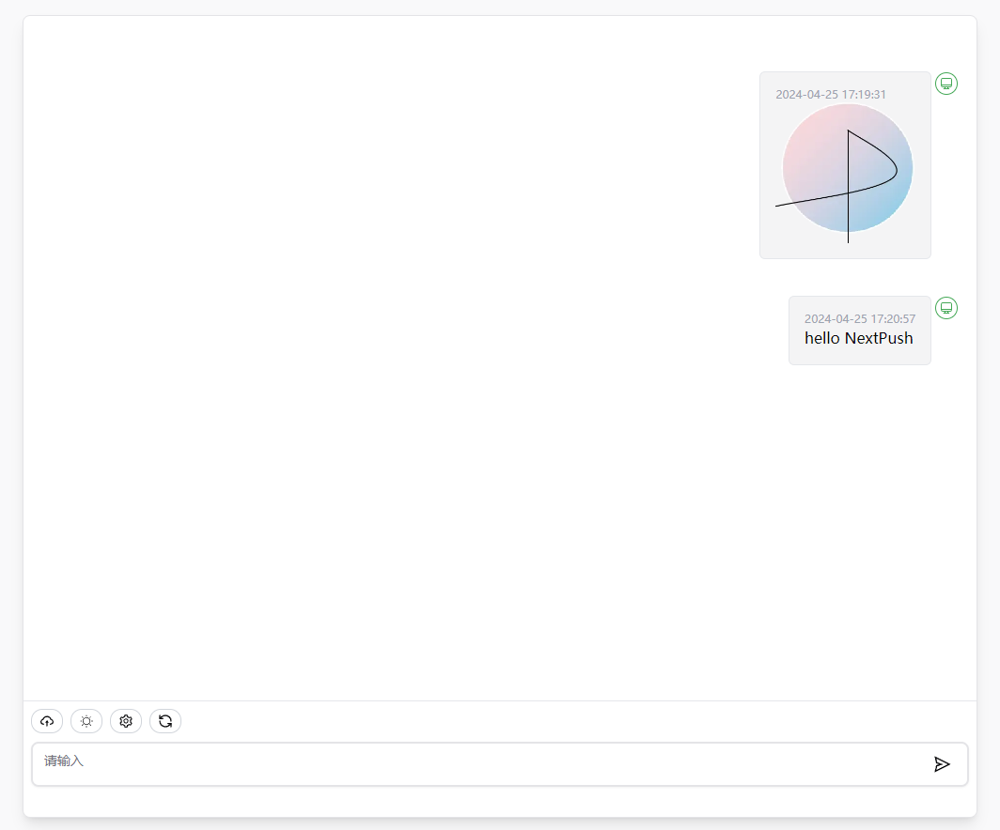
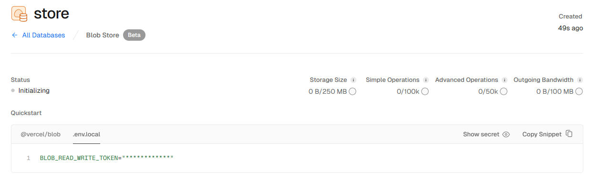

<h1 align="center">NEXT-PUSH</h1>

Free deployment of your personal multi-device mutual transmission messaging application.
English | [简体中文](./README-CN.md)

## Main Features

- Deploy for free with one-click on Vercel in 1 minute.
- Carefully designed UI, responsive design, supports dark mode.
- Supports image and file uploads.
- Supports PWA.
- Message API push GET {{url}}/api/message?text=123 | POST {{url}}/api/message, body:{text:123}

## Screenshots

## Usage

1. Register for a [Vercel](https://vercel.com) account;
2. Go to [Storage – Dashboard](https://vercel.com/puri-seths-projects/~/stores)
3. Create a Blob, obtain the `BLOB_READ_WRITE_TOKEN` 
4. Create Postgres, obtain the `POSTGRES_URL` 
5. Click the button on the right to start deployment:
  , you can directly log in using your Github account, remember to fill in `BLOB_READ_WRITE_TOKEN`, `POSTGRES_URL` in the environment variables page;
6. After the deployment is complete, you can start using it;
7. (Optional) [Bind a custom domain](https://vercel.com/docs/concepts/projects/domains/add-a-domain): The DNS of the domain allocated by Vercel is polluted in some regions, binding a custom domain allows direct connection.

## Contributing

[Local Run](./DEVELOPMENT.md)

## Dependencies

- [NextJS](https://nextjs.org/)
- [trpc](https://trpc.io/)
- [prisma](https://www.prisma.io/)
- [zustand](https://github.com/pmndrs/zustand)

## Open Source License

[MIT](https://opensource.org/license/mit/)
